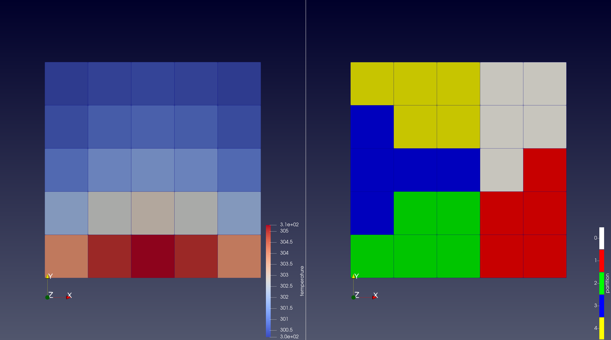
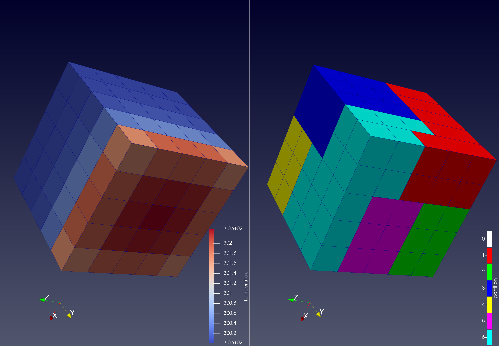
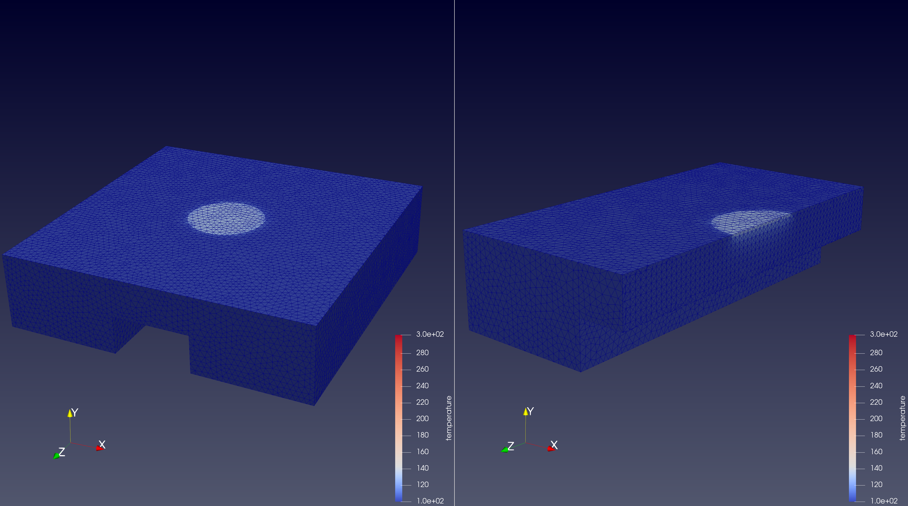

# Overview
parBTE is a Fortran-90 source code for solving the phonon Boltzmann Transport Equation (BTE) to predict the temperature distribution in semiconductors using a 'synthetic' parallelization method. Specifically, the method includes three approaches: cell-based, combined band+cell-based, and batched cell-based. The core kernel of the cell-based approach is an SpMV incorporated with [PETSc](https://petsc.org/release/) via MatShell interface to solve the linear systems of the intensity. In the batched cell-based approach, multiple linear systems associated with different directions are coalesced to optimize communication overhead when grain sizes become smaller. In the combined band+cell-based approach, band-based parallelization is combined with cell-based parallelization to increase the computation/communication ratio (i.e., band-based communication is negligible) given a fixed number of cores. Currently, parBTE supports Jacobi, block Jacobi, and SOR preconditioners.

# Authors
* [Han D. Tran](https://www.cs.utah.edu/~hantran/), University of Utah
* [Siddharth Saurav](https://www.linkedin.com/in/siddharth-saurav-21b18b90), The Ohio State University
* [P. Sadayappan](https://www.cs.utah.edu/~saday/), University of Utah
* [Sandip Mazumder](https://mae.osu.edu/people/mazumder.2), The Ohio State University
* [Hari Sundar](https://www.cs.utah.edu/~hari/), University of Utah
* Syed Ashraf Ali
* Gautham Kollu
* Arpit Mittal

# Publications
* Han D. Tran, Siddharth Saurav, P. Sadayappan, Sandip Mazumder, and Hari Sundar. 2023. Scalable Parallelization for the Solution of Phonon Boltzmann Transport Equation. In 2023 International Conference on Supercomputing (ICS ’23), June 21–23, 2023, Orlando, FL, USA. ACM, New York, NY, USA
* Syed Ashraf Ali, Gautham Kollu, Sandip Mazumder, P. Sadayappan, Arpit Mittal. Large-scale parallel computation of the phonon Boltzmann Transport Equation. International Journal of Thermal Sciences, volume 86, 2014, pages 341-351
# Get parBTE
You can clone the code from this repository https://github.com/paralab/parBTE

# Build parBTE and external libraries
You need the following external packages
* Fortran 90
* MPI
* OpenMP
* [PETSc](https://petsc.org/release/)
* CMake
* The provided *CMakeLists.txt* can be used to build parBTE. By default, the cell-based approach is chosen to build the code. To switch to another approaches, use ccmake ../ to turn ON/OFF the corresponding options.
* To link with PETSc using CMake, you may want to use the CMake modules provided by https://github.com/jedbrown/cmake-modules

# Structure of parBTE
The critical subroutines of parBTE include
* solver.f90 : main subroutine
* variables_module.f90 : defines global variables used in BTE computation  
* constants_module.f90 : defines the contants used in the BTE computation
* implementations of the cell-based parallel methods for solving the linear systems of intensity:
   1. petsc_solver_mod.f90: parent module holding PETSc variables and methods used in all approaches
   2. petsc_matAssembled_mod.f90: module used in PETSc matrix-assembled method, i.e., cell-based method using PETSc's assembled matrix (for comparision with our developments)
   3. amat_parent_mod.f90: parent module of amat_noBatched and amat_batch modules
   4. amat_noBatched_mod.f90: module used in aMat method, no batching
   5. amat_batched_mod: module used in aMat method, with batching
* bsnord_swa_mod.f90 : subroutine (called by main) solving the intensity for all bands and directions using PETSc's assembled matrix
* bsnord_swa_mod_aMat.f90 : subroutine (called by main) solving the intensity for all bands and directions using aMat (no batching) method (i.e. via PETSc's MatShell interface)
* bsnord_swa_mod_aMat_bch.f90 : subroutine (called by main) solving the intensity for all bands and directions using batched aMat method (i.e. via PETSc's MatShell interface)

# Test examples
## Example 1
Simple 2D problem using a mesh of 5*5 cells, solving by various parallel approaches

[//]:


* Dimension: 1 $\mu m$ by 1 $\mu m$
* Boundary condtions: one face is hot isothermal wall (310 K), the other faces are at ambient temperature (300 K)
* The spectral space is discretized into 40 discretized bands (15 bands with 2 polarizations, 25 bands with 1 polarization)
* The angular space is discretized into 25 directions
* Using outer tolerance = inner tolerance = 1E-9. Note: the default value for inner tolerance is 1E-9 defined by mp_RTOL in petsc_solver.f90. However, you can specify the inner tolerance at command line with -ksp_rtol (see example 3 below). The value of outer tolerance is given in model-parameter input file.
* 282 outer iterations to converge for the 1st time step

<br> 

* Using sequential approach (with SOR preconditioner with relaxation factor 1.25):
```
mpirun -np 1 ./tdtr_no_ksub_broi ../examples/2D_5by5_p1.in ../examples/user_polar_2D.in 1 1 -pc_type sor -pc_sor_omega 1.25
```

* Using cell-based approach (5 partitions):
```
mpirun -np 5 ./tdtr_no_ksub_broi ../examples/2D_5by5_p5.in ../examples/user_polar_2D.in 1 5 -pc_type sor -pc_sor_omega 1.25
```

* Using combined band+cell-based approach (4 band partitions, 5 cell partitions):
```
mpirun -np 20 ./tdtr_no_ksub_broi ../examples/2D_5by5_p5.in ../examples/user_polar_2D.in 4 5 -pc_type sor -pc_sor_omega 1.25
```

* Using batched cell-based method, the 3rd parameter is required for batch size, e.g. running with 1 band partition, 5 cell partitions, and batch size = 5:
```
mpirun -np 5 ./tdtr_no_ksub_broi ../examples/2D_5by5_p5.in ../examples/user_polar_2D.in 1 5 5 -pc_type sor -pc_sor_omega 1.25 
```

* Using combined band+batched-cell-based method, e.g. running with 4 band partitions, 5 cell partitions, and batch size = 5:
```
mpirun -np 20 ./tdtr_no_ksub_broi ../examples/2D_5by5_p5.in ../examples/user_polar_2D.in 4 5 5 -pc_type sor -pc_sor_omega 1.25 
```

## Example 2
Simple 3D problem using a mesh of 5*5*5 cells, solving by various parallel methods.

[//]:


* Dimension: 1 $\mu m$ by 1 $\mu m$ by 1 $\mu m$
* Boundary condtions: one face is hot isothermal wall (310 K), the other faces are at ambient temperature (300 K)
* The spectral space is discretized into 40 discretized bands (15 bands with 2 polarizations, 25 bands with 1 polarization)
* The angular space is discretized into 400 directions
* Using outer tolerance = inner tolerance = 1E-9
* 315 outer iterations to converge for the 1st time step

<br> 

* Using sequential approach (with SOR preconditioner with relaxation factor 1.25):
```
mpirun -np 1 ./tdtr_no_ksub_broi ../examples/3D_5by5by5_p1.in ../examples/user_polar_3D.in 1 1 -pc_type sor -pc_sor_omega 1.25
```

* Using cell-based approach (7 partitions):
```
mpirun -np 7 ./tdtr_no_ksub_broi ../examples/3D_5by5by5_p7.in ../examples/user_polar_3D.in 1 7 -pc_type sor -pc_sor_omega 1.25
```

* Using combined band+cell-based (5 band partitions, 7 cell partitions):
```
mpirun -np 35 ./tdtr_no_ksub_broi ../examples/3D_5by5by5_p7.in ../examples/user_polar_3D.in 5 7 -pc_type sor -pc_sor_omega 1.25
```

* Using batched cell-based method (7 partitions, batch size = 10):
```
mpirun -np 7 ./tdtr_no_ksub_broi ../examples/3D_5by5by5_p7.in ../examples/user_polar_3D.in 1 7 10 -pc_type sor -pc_sor_omega 1.25
```

* Using combined band+batched-cell-based method, e.g. running with 5 band partitions, 7 cell partitions, and batch size = 10:
```
mpirun -np 35 ./tdtr_no_ksub_broi ../examples/3D_5by5by5_p7.in ../examples/user_polar_3D.in 5 7 10 -pc_type sor -pc_sor_omega 1.25 
```

## Example 3
A device-like structure, 600k cells.\
The mesh file, 600k_40p.in, can be downloaded at https://drive.google.com/drive/folders/1SMTFSalGyNKMjh8qAbyIwLU5ZVHttBrH?usp=sharing

[//]:


* Dimension: 4 $\mu m$ by 4 $\mu m$ by 1 $\mu m$
* Boundary condtions: a heat source generates the heat on one surface with a nominal temperature of 150 K. The rectangular cooling channel temperature is set to 100 K. An adiabatic condition (i.e., zero heat flux) is applied to other boundary faces of the device.
* 40 discretized bands (2 polarizations for bands 1-15, 1 polarization for bands 16-40), 400 discretized directions
* 43 outer iterations to converge for the 1st time step

<br> 

* Using cell-based appraoch (40 partitions, it takes ~8 hours to complete the first time step when using a relative tolerance of 1E-6 for GMRES (i.e., inner tolerance) and 1E-6 for outer tolerance):
```
mpirun -np 40 ./tdtr_no_ksub_broi ../examples/600k_40p.in ../examples/user_polar_600k.in 1 40 -pc_type sor -pc_sor_omega 1.25 -ksp_rtol 1E-6
```

* Using combined band+cell-based approach (4 partitions in band dimension, 40 partitions in cell dimension):
```
mpirun -np 160 ./tdtr_no_ksub_broi ../examples/600k_40p.in ../examples/user_polar_600k.in 4 40 -pc_type sor -pc_sor_omega 1.25 -ksp_rtol 1E-6
```

# Format of input files

## Model-parameters
The second argument in the command line is model-parameter input file (ASCII file), with the examples given above.

## Mesh definition
The first argument in the command line is the mesh file (ASCII file), with the examples given above. The mesh is defined globally, i.e. every process reads the same global mesh file. Based on the partition ID given in the mesh, each process determines/extracts its owned local mesh based on the global mesh. The overall structure of a mesh file is as following.\
* nCells nFaces nNodes nBdrFaces\
* 3d_flag flag_1 (flag_1 is irrelevant in this problem)\
* nFaces_cell1 nVertices_cell1 partitionID_cell1\
...\
(up to nCells)\
...
* x_cell1 y_cell1 z_cell1\
...\
(up to nCells)\
...
* x_face1 y_face1 z_face1 area_face1 normalX_face1 normalY_face1 normalZ_face1\
...\
(up to nFaces)\
...
* x_vetex1 y_vertex1 z_vertex1\
...\
(up to nVertices)\
...
* cell2face_connectivity_cell1\
...\
(up to nCells)\
...
* cell2vertex_connectivity_cell1\
...\
(up to nCells)\
...
* face2cell_connectivity_face1\
...\
(up to nFaces)\
...
* nVertices_face1
...\
(up to nFaces)\
...
* face2vertex_connectivity_face1
...\
(up to nFaces)\
...
* cell2cell_connectivity_cell1
...\
(up to nCells)\
...
* n_bdrCond_patches
* n_faces_patch1
* $\phi$ _face
...\
(up to n_faces_patch1)\
...
* (up to n_bdrCond_patches)
* bdrFace_flag_face1 face2BdrFace_face1
...\
(up to nFaces)\
...
* bdrType_bdrFace1 bdrFace2Face_bdrFace1 bdrFace2Cell_bdrFace1
...\
(up to nBdrFaces)\
...
* cellType_cell1
...\
(up to nCells)\
...
* materialType_cell1
...\
(up to nCells)\
...

# Postprocessing
* Subroutine postprocess_vtk.f90 writes out the cell-center temperatures to vtk-format file, which can be visualized by ParaView https://www.paraview.org. Currently, the visualized output does not support multiple cell types in the mesh. Choosing of vtk cell type is hard-coded in the variables_module.f90
* Each process outputs the partial mesh (and associated results) owned by itself. The grouping of all partial meshes can be done using Group Datasets filter in Paraview
